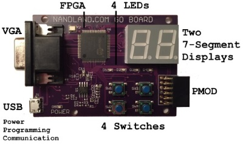

# Go Board NandLand

This is a Fork of the original [NandLand github Repository](https://github.com/nandland/nandland)
in order to add documentation and additional information about GoBoard development card.

Contains all project code found on [www.nandland.com](https://www.nandland.com)

Support [NandLand via Patreon](https://www.patreon.com/user?u=2732133)

## Requirements

- GoBoard can be purchased at [NandLand Go Board Page](https://www.nandland.com/goboard/introduction.html).
- a Micro USB to USB cable
- a Computer under Linux or Windows for iCEcube2

## License

MIT License, Copyright (c) 2013-2020 Nandland.com

## GoBoard Features

- Lattice ICE40 HX1K FPGA
- EASY USB Connection for power, communication, and programming
- Four User Settable LEDs
- Four Push-Buttons
- Dual 7-Segment LED Display
- VGA Connector
- External Connector (PMOD)
- 25 MHz on-board clock
- 1 Mb Flash for booting up your FPGA

## Youtube Videos

- [NandLand Channel](https://www.youtube.com/channel/UCsdA-aNqtMA1_2T15aXePWw)
- [What is an FPGA? Intro for Beginners](https://www.youtube.com/watch?v=CfmlsDW3Z4c)
- [Introduction to Logic Gates on an FPGA: And, Or, Not, NAND,](https://www.youtube.com/watch?v=bp32ZYTY1uk&t=82s)
- [Boolean Algebra And LUTs in FPGA](https://www.youtube.com/watch?v=Usoo2j2TQio)
- [What is a Flip-Flop? How are they used in FPGAs?](https://www.youtube.com/watch?v=lrXjuotxqzE)
- [The Go Board - The First FPGA Development Board You Should Buy](https://www.youtube.com/watch?v=fLua2urAuq0)
- [Nandland Go Board - Watch This When You Receive Your Board](https://www.youtube.com/watch?v=wWMIY9kjlJ0)
- [iCEcube2 Installation and Overview](https://www.youtube.com/watch?v=nfB8-8JfVFE&t=4s)
- [Nandland Go Board Project 1 - Switches and LEDs](https://www.youtube.com/watch?v=l_eo21vHxw0)
- [Nandland Go Board Project 2 - The Look-Up Table (LUT)](https://www.youtube.com/watch?v=bps5v5OeJkA)
- [Nandland Go Board Project 3 - The Flip-Flop (AKA Register)](https://www.youtube.com/watch?v=_7K-ty3Mffg&t=1056s)
- [Nandland Go Board Project 4 - Debounce A Switch](https://www.youtube.com/watch?v=plGDQDyLDR0)
- [Nandland Go Board Project 5 - Seven Segment Display](https://www.youtube.com/watch?v=iT9MVuIZFJ8)
- [Nandland Go Board Project 6 - Simulating LEDs Blinking](https://www.youtube.com/watch?v=V-Kmj8T_Byg)
- [Nandland Go Board Project 7 - UART Receiver](https://www.youtube.com/watch?v=Vh0KdoXaVgU)
- [Nandland Go Board Project 8 - UART Transmitter (Loopback)](https://www.youtube.com/watch?v=Jy5jRhDqNss)
- [Nandland Go Board Project 9 - Introduction to VGA](https://www.youtube.com/watch?v=7wjTJivsNMM)
- [Nandland Go Board Project 10 - Pong! (On your VGA Monitor)](https://www.youtube.com/watch?v=sFgNpK4yQwQ)

Other video related to FPGA can be found at [NandLand Youtube Channel](https://www.youtube.com/channel/UCsdA-aNqtMA1_2T15aXePWw)

## Documentation

### Startup 

- [Test your new GoBoard](./docs/test_new_goboard.md)
- [iCEcube Download, Install and License](./docs/install.md)
- [Programmer and Deployment Tool](./docs/install_deployment.md)
- [GoBoard iCEcube2 new project](./docs/icecube_new_project.md)
- [Build Process and Programming your FPGA](./docs/build_process.md)

### Projects

- [Project 1 - Switches and LEDs](./docs/project_1.md)
- [Project 2 - The Look-Up Table (LUT)](./docs/project_2.md)
- [Project 3 - The Flip-Flop (AKA Register)](./docs/project_3.md)
- [Project 4 - Debounce A Switch](./docs/project_4.md)
- [Project 5 - Seven Segment Display](./docs/project_5.md)
- [Project 6 - Simulating LEDs Blinking](./docs/project_6.md)
- [Project 7 - UART Receiver](./docs/project_7.md)
- [Project 8 - UART Transmitter (Loopback)](./docs/project_8.md)
- [Project 9 - Introduction to VGA](./docs/project_9.md)
- [Project 10 - Pong! (On your VGA Monitor)](./docs/project_10.md)
