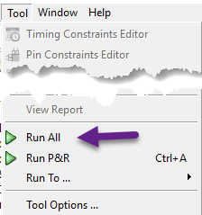

# Build Process

- Related NandLand Youtube video: [Nandland Go Board Project 1 - Switches and LEDs](https://www.youtube.com/watch?v=nfB8-8JfVFE)
- Original [Post at Nandland.com](https://www.nandland.com/goboard/your-first-go-board-project.html). 
- Original [Go_Board_Constraints.pcf at Nandland.com](https://www.nandland.com/goboard/Go_Board_Constraints.pcf).

## Table of Contents

- [Building your FPGA design](#building-your-fpga-design)
  - [What is Synthesis?](#what-is-synthesis)
  - [What is Place and Route (P&R)?](#what-is-place-and-route-pr)
- [Ding Ding Ding! Come and get your Constraint File!](#ding-ding-ding-come-and-get-your-constraint-file)
- [Building the FPGA Bitstream File](#building-the-fpga-bitstream-file)
- [Programming the FPGA](#programming-the-fpga)

## Building your FPGA design

Once you have the coding done, it's time to build the design! Open iCEcube. 
Click **File** then **New Project**. 
You will be greeted with an intimidating window asking for a bunch of specific information about your FPGA board. 
I'll be nice and tell you how to set those values:

- Set `Project Name` with your desired project name
- In `Device` set
  - `Device Family` to `ICE40` 
  - `Device`  to `HX1K`
  - `Device Package`  to `VQ100`
- In `IOBank Voltage(V)` set
  - `topBank`  to `3.3`
  - `leftBank`  to `3.3`
  - `bottomBank`  to `3.3`
  - `rightBank`  to `3.3`
- Select `Start From Synthesis`
- Click `Next`


These are the settings that you will be using for every single Go Board project, so keep that in mind. 
Click Next when you're done here. This next dialog box prompts you to add the Verilog or VHDL source file that 
you created previously. You can do that now. Or alternatively you can skip this step by clicking **Finish**. 
Instead you can expand **Synthesis Tool** and right click on **Design Files** to add your file to your project. 
The Verilog or VHDL that you add is used for **Synthesis**.


### What is Synthesis?

It's probably worth taking a minute to discuss the first phase of your FPGA build process. The iCEcube2 tool takes 
the code that you wrote and goes through a process called synthesis. Synthesis converts the VHDL or 
Verilog code into physical elements that are available on your particular FPGA. An FPGA has dedicated pieces of 
logic on it. It has `wires`, it has `Look-Up Tables`, it has `Registers`, and it has some `Memory`.
It can have other things, but these are by far the most targeted elements during synthesis. 
It's OK if you aren't comfortable with each of these right now, we'll talk about them each individually. 
Since this design is very simple (eg: project 1), it will use very little of your FPGA resources in the synthesis process, 
just a few wires to route signals. After the design is done with Synthesis, it goes to Place and Route (P&R).

### What is Place and Route (P&R)?

Place and Route is the second phase of the FPGA build process. Synthesis converts the code to physical components 
available to your FPGA. Place and Route takes those components and **places** them on your FPGA. You can think of an 
FPGA as a large grid of these components. Place and Route will assign which component gets used where. 
It is a particularly important step of the FPGA build process for designs that use clocks. 
This particular design (eg: project 1) does not require the use of a clock, so Place and Route is not as important. 
We will see in future projects how clocks play a pivotal role in FPGAs, and you'll understand more about 
Place and Route then.

One very important thing that Place and Route does is it assigns the signals at the top level of your FPGA design 
to physical pins on the device.
**You need to tell the tools how to map each signal in your design to a physical pin on the device!**
This is a very important step and if you do not tell Place and Route how to assign the pins, it will 
just choose them on its own and it will be wrong. Does `i_Switch_1` go on `Pin 1` or `Pin 100`? This gets set in 
a `Constraints File`. Again, I'll be nice and give you the constraints file needed for the Go Board. 
This provides the mapping for all of your pins on the projects that we will encounter. 
You'll notice in the constraint file that there's more signals than we created in the code above. 
That's OK, we'll use those extra signals eventually.

Sample of `Go_Board_Constraints.pcf` constraints file:

```text
# [i/o]_Name_used_in_your_program  [FPGA Pin]
### LED Pins:
set_io o_LED_1 56
set_io o_LED_2 57
set_io o_LED_3 59
set_io o_LED_4 60

## Push-Button Switches
set_io i_Switch_1 53
set_io i_Switch_2 51
set_io i_Switch_3 54
set_io i_Switch_4 52
```

## Ding Ding Ding! Come and get your Constraint File!

Here's a link to the [Go_Board_Constraints.pcf](../Go_Board_Constraints.pcf).
Save this file in your project directory and add it to your project in iCEcube2. 
This is done under **P&R Flow** then expand **Add P&R Files** then add it under **Constraint Files**.


## Building the FPGA Bitstream File

We're geting close, I promise. Everything is set. You created your project. 
The code has been added to your project. The constraints have been added. Now it's time to build the bitstream! 
This is the file that is used by your FPGA to program itself. Click **Tool** then **Run All**.


 
This should go through the entire build process, from **Synthesis**, through **Place & Route**, to **Generating** your 
bitstream file.

> Just a note here: you'll see Bitmap in iCEcube2, **Bitmap** is the program that creates the *bitstream*.

 You should see some nice green check marks appear. Take a minute to look at the Output from the build process, 
 the tools give you some neat information about what's happening behind the scenes.
 


## Programming the FPGA

Open the **Diamond Programmer tool**. You should be greeted with this screen. 
If you do not see that the Cable has been detected successfully (`FTUSB-0`), you may need to install the
 [FTDI Drivers](http://www.ftdichip.com/Drivers/VCP.htm).
 


Now the way the Go Board works is that there is an integrated circuit that turns the USB connection to a SPI interface, 
which is used to program a Flash chip that's installed on the Go Board. 
**The purpose of using Diamond Programmer is to load this Flash over the USB.**
Once the flash has been loaded, the FPGA will boot up from the flash and 
you'll see the fruits of your labor!
 
Since you're going to a SPI Interface, the Programmer will be **unable** to detect the FPGA:


 
That's OK, you will need to tell the Programmer about what FPGA you do have on the Go Board. 
Select **Device Family** as `iCE40` and **Device** as `iCE40HX1K` :


Now double click under **Operation** and next to **Access Mode** select `SPI Flash Programming`.
That will bring up the picture as shown below. You will need to select your programming bitstream that you built.
**This is located in your iCEcube2 project directory** `/sbt/outputs/bitmap/`.

Make sure to select **Family** as `SPI Serial Flash`, **Vendor** as `Micron` and **Device** as `M25P10`.

> In previous iCEcube2 version, `M25P10` was labeled `SPI-M25P10-A`.


Now click **Design** and select **Program**:

> Caution: No serial terminal (Tera Term or Putty) should be running at the same time as Diamon Programmer


If everything was done correctly, you should see `INFO - Operation Successful`. 
This means that your SPI Flash has been programmed and your FPGA is running! 

Try pushing a button! LEDs blink! (eg: project 1)

**Congratulations, you've built your first FPGA project!** 

Once you set this up, you should save your Diamond Programmer settings so that you only need to go through this once!