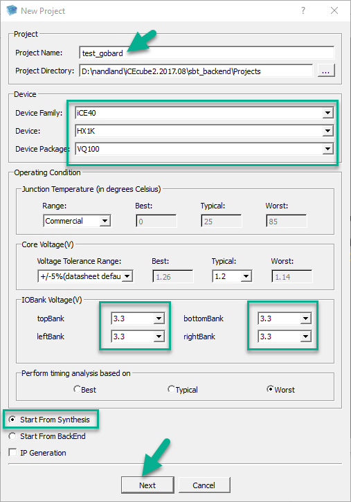

# GoBoard iCEcube2 new project

Related NandLand Youtube video: [iCEcube2 Installation and Overview - 5m05sec](https://youtu.be/nfB8-8JfVFE?t=305)

## New Project

- Start iCEcube2
- Double click on `New Project`

- Set `Project Name` with your desired project name
- In `Device` set
  - `Device Family` to `ICE40` 
  - `Device`  to `HX1K`
  - `Device Package`  to `VQ100`
- In `IOBank Voltage(V)` set
  - `topBank`  to `3.3`
  - `leftBank`  to `3.3`
  - `bottomBank`  to `3.3`
  - `rightBank`  to `3.3`
- Select `Start From Synthesis`
- Click `Next`

- on `Add Files` windows select your file and/or click `Finish`

At this point, without any file, your project will look like:

