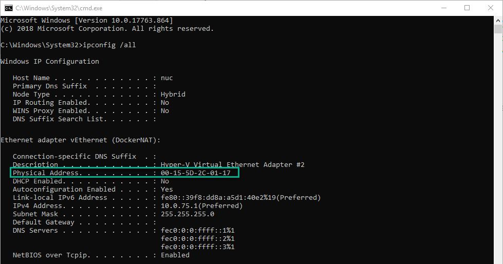

# iCEcube Download and Install

Related NandLand Youtube video: [iCEcube2 Installation and Overview](https://www.youtube.com/watch?v=nfB8-8JfVFE&t=4s)

## Prerequisites

- Create an account on [Lattice Semiconductor website](http://www.latticesemi.com/Accounts/AccountRegister)
- Download [Lattice Semiconductor iCEcube2 Software](https://www.latticesemi.com/en/Products/DesignSoftwareAndIP/FPGAandLDS/iCEcube2)  
- Generate a [Lattice Semiconductor iCEcube2 Free Licence](https://www.latticesemi.com/Support/Licensing/DiamondAndiCEcube2SoftwareLicensing/iceCube2) 

## License Generation

During License request on Lattice website, a MAC address will be requested.
A MAC Address is a physical device Address for your network card.

In order to get a MAC address:

### Windows IpConfig

Start a command shell:
- (Windows+R) key > Open command "cmd"
- type "ipconfig /all"
- locate a "Physical Address"

Choose any Network MAC Address you want, it does not seems to matter which card, in this
example i used a virtual Docker Network Adapter.

### Linux Ip Addr

- Start a terminal
- type "ip addr"
- find your MAC address under "link/ether"

## Installation

- After downloading iCEcube2 install it
- Provide `license.dat` file received by mail

## Missing License during installation

If you don't have the `license.dat` yet you can click next during installation step
and provide it later:
- iCEcube2 will request it at startup
- or go in your iCEcube2 installation directory and start `LicenseSetup` again

 