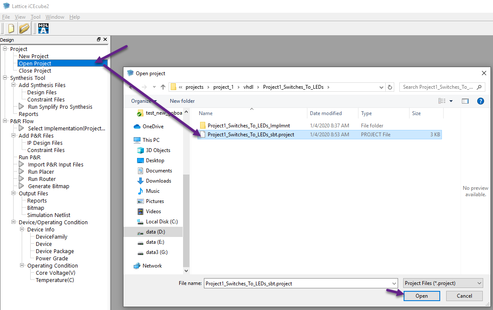
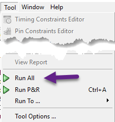

# Use preconfigured iCEcube2 Nandland projects

Preconfigured projects are available in [projects directory](../projects).

Each project directory contains:
- bin: a precompiled bin file to write on your FPGA board, to be use with **Diamond Programmer** Tool, as described 
in [Programming the FPGA](./build_process.md#programming-the-fpga) 
- verilog: Verilog project's version
- vhdl: VHDL project's version

## Open preconfigured project

- Open iCEcube2
- Click on `Open Project`
- Select project file with extension `.project`
- Click `Open`

## Run All

As described in [Build Process - Building the FPGA Bitstream File](./build_process.md#building-the-fpga-bitstream-file),
 **Run All** to recompile the code:

