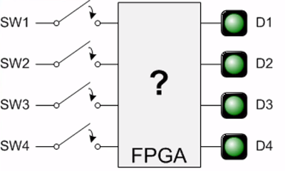

# Project 1 - Switches and LEDs

Related NandLand Youtube video: [Nandland Go Board Project 1 - Switches and LEDs](https://www.youtube.com/watch?v=l_eo21vHxw0)
Original [Post at Nandland.com](https://www.nandland.com/goboard/your-first-go-board-project.html). 

## Goals

Now it's time to get cracking! The first project that we are going to do is going to be as simple as possible.
All we are going to do is program the FPGA to perform one task: 
**When a button is pushed, one of the LEDs should light up**
 
This is a perfect project to do first, because it will take us through the entire build flow.
 From coding the VHDL or Verilog, to building the FPGA bitstream, to programming the Go Board, this tutorial will walk 
 you through everything you need to know. 
 
Note that this project is 90% the same should you be learning VHDL or Verilog, so I lumped both into the same lesson.
The Go Board tutorials build on each other, so it's important to do them in order and remember what you learned!
Let's get started!

The first thing you are going to do is create your VHDL or Verilog code that tells the FPGA what to do. 
Again, we are going to be creating code that tells the FPGA to light up one of the four LEDs when a particular
switch is pushed.


 
The image shows what this looks like. When Switch 1 (SW1) is pushed down on the Go Board, we want D1 to light up. 
When the button SW1 is released, D1 should turn off. This is a simple FPGA design, but going through the code 
and the build process will get you comfortable with everything before we get to more complicated designs.

## Project Design

No matter which language you decide to use, you should give the project some thought before you begin.
As shown in the image above, you have eight signals to deal with. Four of the signals are inputs and four others 
are outputs. The inputs are your switches, the outputs are your LEDs. How can you design code such that when a 
button is pushed, an LED is illuminated? Give it some thought, try to write the code on your own. 
The answers for both Verilog and VHDL are shown below.

### Verilog

```verilog
# Verilog Code - Switches_To_LEDs.v
module Switches_To_LEDs
  (input i_Switch_1,  
   input i_Switch_2,
   input i_Switch_3,
   input i_Switch_4,
   output o_LED_1,
   output o_LED_2,
   output o_LED_3,
   output o_LED_4);
       
  assign o_LED_1 = i_Switch_1;
  assign o_LED_2 = i_Switch_2;
  assign o_LED_3 = i_Switch_3;
  assign o_LED_4 = i_Switch_4;
 
endmodule
```

Let's talk about the Verilog code above. The first keyword you encounter is `module`. Modules are the blocks of code 
that perform some functionality. Modules can contain all of the code you need, such as the code above, or they can 
instantiate other modules. More complicated designs will create levels of hierarchy by having many modules. 
On the module, you must define the interfaces, which consist of inputs and outputs. In this case, we are creating 
four inputs and four outputs. You can think of these inputs and outputs of being either a 0 or 1 in binary. 
The inputs and outputs are going to be connected to specific pins on the Go Board. This connection is done later 
(and is not part of the Verilog code).

The last keyword introduced in this first project is `assign`. Assign is used to connect two signals together. 
There are some rules about this keyword, but for now I'll just tell you that it must be used outside an `always block`. 
Always blocks are for the a later project, so don't worry about them for now. Once all of the output signals are 
assigned to the input signals, we have successfully connected all LED outputs to the Switch inputs. 
Now when `i_Switch_1` **goes high (to a binary 1)** `o_LED_1` **will also go high**. 
Conversely when `i_Switch_1` **goes low (to binary 0)** `o_LED_1` **will also go low**. 
You are literally tying the two of them together in your FPGA. 
There will actually be a physical connection inside the FPGA between these two pins. Neat huh?! 
You need to remember that the code you are writing is designing a physical circuit inside the FPGA. 
This particular circuit is pretty simple, but it's still a circuit!

### VHDL

```vhdl
library ieee;
use ieee.std_logic_1164.all;
 
entity Switches_To_LEDs is
  port (
    -- Push-Button Switches:
    i_Switch_1 : in std_logic;
    i_Switch_2 : in std_logic;
    i_Switch_3 : in std_logic;
    i_Switch_4 : in std_logic;
     
    -- LED Pins:
    o_LED_1 : out std_logic;
    o_LED_2 : out std_logic;
    o_LED_3 : out std_logic;
    o_LED_4 : out std_logic
    );
end entity Switches_To_LEDs;
 
architecture RTL of Switches_To_LEDs is
begin
  o_LED_1 <= i_Switch_1;
  o_LED_2 <= i_Switch_2;
  o_LED_3 <= i_Switch_3; 
  o_LED_4 <= i_Switch_4;
end RTL;
```

Let's talk about the VHDL code above. Perhaps the first thing you might notice if you compare the Verilog code to 
the VHDL code is that the VHDL code is a bit longer. This is a common theme. VHDL generally takes more typing to 
accomplish the same task. The first two lines of this code tell the tools about which libraries and packages you are 
using in your code. Take it for granted that these two lines will likely be in every single piece of VHDL you ever write.
 For now, don't worry about what they're actually doing, just put them there.

The next keyword you encounter is `entity`. The entity of a design can be thought of as the interface to the outside
world. Entity and `architecture` are the two VHDL keywords that define the functionality of some block of code. Together, 
 an entity and architecture make up some piece of functionality in your FPGA design. A single entity/architecture 
 combination can contain all of the code you need, such as the code above, or they can instantiate other entities. 
 More complicated designs will create levels of hierarchy by having many entity/architectures.

Next, you need to specify any signals that are on this interface after using the `port` keyword. Once you give the signals
 a name (e.g. `i_Switch_1`), you need to specify the direction: `in`, `out`, or `inout` (used rarely). After that,
give your signals a type. `std_logic` is the most prevalent type in VHDL and can be thought of as a bit containing 0 or 1 
 (though it can actually have more values than just that as we will see later). These inputs and outputs are going to 
 be connected to specific pins on the Go Board. This connection is done later (and is not part of the VHDL code).

After the architecture, you need to use the `<=` **assignment symbol**. An assignment is used to connect two signals 
together. Note that if you try to just use a normal assignment like = as used in C, you'll get a tool error. Once all 
of the output signals are assigned to the input signals, we have successfully connected all LED outputs to the Switch 
inputs. 
Now when `i_Switch_1` **goes high (to a binary 1)** `o_LED_1` **will also go high**.
Conversely when `i_Switch_1` **goes low (to binary 0)** `o_LED_1` **will also go low**. 
You are literally tying the two of them together in your FPGA. 
There will actually be a physical connection inside the FPGA between these two pins. Neat huh?! 
You need to remember that the code you are writing is designing a physical circuit inside the FPGA.
This particular circuit is pretty simple, but it's still a circuit!

## Building your FPGA design

