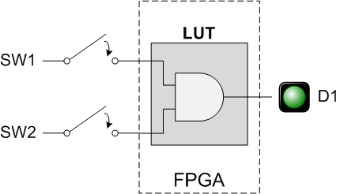
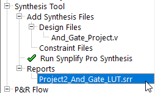
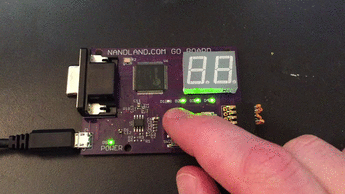
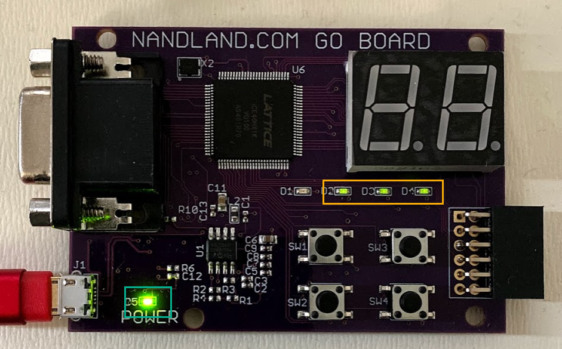
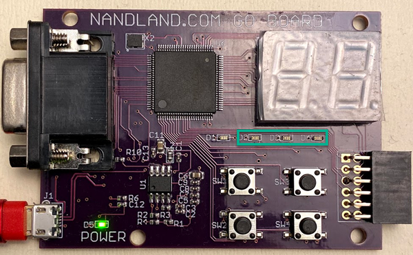

# Project 2 - Introducing Look-Up Tables (LUTs)

- Related NandLand Youtube video: [Nandland Go Board Project 2 - The Look-Up Table (LUT)](https://www.youtube.com/watch?v=bps5v5OeJkA)
- Original [Post at Nandland.com](https://www.nandland.com/goboard/look-up-tables-luts-boolean-logic.html). 
- Preconfigured project is located in [projecs/project_2](../projects/project_2)
- Precompiled Bin is located in [projecs/project_2/bin](../projects/project_2/bin)

## Table of Contents

- [How Boolean Algebra is Actually Performed on an FPGA](#building-your-fpga-design)
- [Project Description](#project-description)
  - [Verilog](#verilog)
  - [VHDL](#vhdl)
  - [Building your design and Programming your FPGA](#building-your-design-and-programming-your-fpga)
  - [Tests](#tests)
- [Unused Output State](#unused-output-state)
- [Additional Exercises](#additional-exercises)
  - [AND Gate with LED D2, D3 and D4 Initialization](#and-gate-with-led-d2-d3-and-d4-initialization)
    - [Verilog](#verilog-1)
    - [VHDL](#vhdl-1)
    - [Build and Test](#build-and-test)
  - [AND, NAND, OR and NOR Implementation](#and-nand-or-and-nor-implementation)
    - [Verilog](#verilog-2)
    - [VHDL](#vhdl-2)
    - [Build and Test](#build-and-test-1)
  - [XOR and XNOR Implementation](#xor-and-xnor-implementation)
    - [Verilog](#verilog-3)
    - [VHDL](#vhdl-3)
    - [Build and Test](#build-and-test-2)

## How Boolean Algebra is Actually Performed on an FPGA

Have you ever wondered how an AND gate actually works inside your FPGA? An AND gate is a type of logic circuit 
that has two inputs and one output. The output is equal to 1 only when both inputs are equal to 1. 
Unless both inputs are 1, the output will be 0. It's a very simple Boolean logic circuit. 
Boolean logic simply means all variables can have the value 1 or 0 (or as sometimes called in FPGAs, high and low). 
There are other types of simple Boolean logic components: OR, NOT, XOR, NAND, etc. 
But have you ever considered how these are actually implemented inside of an FPGA? 
Are there really thousands of individual AND gates, just waiting to be wired up? That would not be very versatile. 
Instead, FPGAs use Look-Up Tables or LUTs. 

**LUTs are a fundamental component used to perform all Boolean logic inside your FPGA**.
 
I also created a YouTube video for this project, should you prefer to follow along with that.

[](https://www.youtube.com/watch?v=bps5v5OeJkA)

A truth table shows every possible input combination and what the resulting output will be. 
Let's look at the truth table for an `AND` gate. Remember, the `AND` gate Output is 1 when input A *AND* input B are 1.

**Truth Table - A AND B**:

| Input A  | Input B | Output Q  |
| :----: | :----: | :-----: |
| 0 | 0 | 0 |
| 0 | 1 | 0 |
| 1 | 0 | 0 |
| 1 | 1 | 1 |


Now what if we wanted to change this to an `OR` gate? An `OR` gate means that the output will be 1 
if input A *OR* input B are 1. If neither A *OR* B are 1, then the output will be 0. 
Let's take a look at that truth table:

**Truth Table - A OR B**:

| Input A  | Input B | Output Q  |
| :----: | :----: | :-----: |
| 0 | 0 | 0 |
| 0 | 1 | 1 |
| 1 | 0 | 1 |
| 1 | 1 | 1 |

A Look-Up Table (LUT) is how any arbitrary Boolean logic gets implemented inside your FPGA. 
The above examples show a 2-input LUT that has been configured to be an AND gate and an OR gate. 
But given 2-inputs, there's lots of possible output combinations, which all must be possible to satisfy 
given a 2-input LUT. 

Therefore, **a 2-input LUT can implement any Boolean output given 2-inputs**. 

There are 3-input, 4-input, and even 5-input LUTs on FPGAs. 
The Go Board uses LUT4s, which are 4-input LUTs. This means that any possible Boolean logic you can
come up with given 1-output and 4-inputs can be programmed into a single LUT element. 
Note that you don't actually need to have 4-inputs, you can use a single LUT to make a 2-input AND gate. 
The tools will simply tie off input 3 and input 4 if they are unused. 
Check [this page for more detail](https://www.nandland.com/articles/boolean-algebra-using-look-up-tables-lut.html) 
about LUTs and Boolean Logic in general.

In a real FPGA, the output of one LUT can be routed (wired) into the input of another LUT. This allows you 
to create Boolean logic with five or more inputs, even if you only have LUT4s on your FPGA. 
It is the job of the synthesis tool to take your VHDL or Verilog code, extract any Boolean logic,
and convert the Boolean equations into LUTs. A good synthesis tool will keep the utilization of these LUTs 
as low as possible. On the Go Board, there are a total of 1280 LUTs available for you to use. 
The previous project didn't use a single LUT, but this one will.

> Note: Using cascading LUTs can impact your signal propagation since signal will need to reach multiple LUT table
> in cascade to output a result.

## Project Description

**This project should illuminate LED D1 when both Switch 1 and Switch 2 are pushed at the same time**



We are creating an `AND` gate! This is a very simple usage of a Look-Up Table. Only 2 inputs will actually 
be needed from the 4-input LUT. The tools will take care of all of this for you. 
On this page you'll find both the Verilog and the VHDL code for this design. 

### Verilog

Let's look at the Verilog code for this design.

```verilog
module And_Gate_Project
  (input i_Switch_1,  
   input i_Switch_2,
   output o_LED_1);
       
  assign o_LED_1 = i_Switch_1 & i_Switch_2;
 
endmodule
```
Preconfigured project is located in [projecs/project_2/verilog/Project2_And_Gate_LUT](../projects/project_2/verilog/Project2_And_Gate_LUT)

In the Verilog code above, we have introduced our first **operator**, the ampersand `&`.
This is known as a [*bitwise operator*](https://www.nandland.com/verilog/examples/example-bitwise-operators.html).
In the code above, `o_LED_1` will be 1 only when `i_Switch_1` and `i_Switch_2` are both 1.
This means that you will need to push *both* of those buttons down to get the LED to illuminate.

### VHDL

```vhdl
library ieee;
use ieee.std_logic_1164.all;

entity And_Gate_Project is
  port (
    -- Push-Button Switches:
    i_Switch_1 : in std_logic;
    i_Switch_2 : in std_logic;

    -- LED Pin:
    o_LED_1 : out std_logic
    );
end entity And_Gate_Project;

architecture RTL of And_Gate_Project is
begin
  o_LED_1 <= i_Switch_1 and i_Switch_2;
end RTL;
```
Preconfigured project is located in [projecs/project_2/verilog/Project2_And_Gate_LUT](../projects/project_2/verilog/Project2_And_Gate_LUT)

In the VHDL code above, we have introduced our first operator, the keyword `and`.
This is known as a *logical operator*. 
In the code above, `o_LED_1` will be 1 only when `i_Switch_1` and `i_Switch_2` are both 1.
This means that you will need to push *both* of those buttons down to get the LED to illuminate.

### Building your design and Programming your FPGA

Your code is complete. Now you need to build the bitstream and program your FPGA. 
This follows the exact same process as the first project.
See [Build Process and Programming your FPGA documentation](./build_process.md)

Once the FPGA build process is complete, I would like to direct your attention to the Synthesis Report file. 
This can be viewed from within iCEcube2 by expanding **Reports** under **Synthesis Tool**.
Double click the file and scroll to the bottom. You'll see a report that shows the resource utilization on your FPGA:



In our previous project, we were just using I/O ports (Input/Output), but now there's a new element shown. 

**We see that exactly one Look-Up Table (LUT) is being used! How exciting!** 

**You have successfully created an And Gate on an FPGA!**

```text
---------------------------------------
Resource Usage Report for And_Gate_Project 

Mapping to part: ice40hx1kvq100
Cell usage:
SB_LUT4         1 use

I/O ports: 3
I/O primitives: 3
SB_IO          3 uses

I/O Register bits:                  0
Register bits not including I/Os:   0 (0%)
Total load per clock:

@S |Mapping Summary:
Total  LUTs: 1 (0%)

Distribution of All Consumed LUTs = LUT4 
Distribution of All Consumed Luts 1 = 1 

Mapper successful!
```

### Tests

After programming your board, hold both `SW1` and `SW2` and the `LED D1` should illuminate! 
You'll notice that D2, D3, and D4 are always on, that's OK. Congratulations, you now know what a LUT is! 
LUTs are used everywhere in your FPGA. They are used to make counters, state machines, if statements, lots! 
As you write more code the concept will get more comfortable. 
But LUTs are really only half of the story when designing FPGAs. As important as LUTs are, there's another critical 
component on your FPGA: The Flip-Flop (AKA Register). Without Flip-Flops, FPGAs would be basically useless. 
So let's learn about what a Flip-Flop is and how it plays such an important role in FPGA design.

My finger holds both `SW1` and `SW2` illuminates `LED D1`:



## Unused Output State

In this project we didn't use LED `D2`, `D3` and `D4`, therefore no state has been defined
in our program. In that case FPGA does not set a defined state for these outputs
and LEDs are in an undefined state and it can been seen on your Go Board: 
LED `D2`, `D3` and `D4` are light up a little bit like they are not fully powered.
Check LED `D2`, `D3` and `D4` versus POWER `C5` LED:



## Additional Exercises

### AND Gate with LED D2, D3 and D4 Initialization

With your previous `AND` Gate, initialize output of LED `D2`, `D3` and `D4` to 0 to get a clean output state.

#### Verilog

Let's look at the Verilog code for this design.

```verilog
module And_Gate_With_Init_Project
  (input i_Switch_1,  
   input i_Switch_2,
   output o_LED_1,
   output o_LED_2,
   output o_LED_3,
   output o_LED_4);
       
  assign o_LED_1 = i_Switch_1 & i_Switch_2;
  assign o_LED_2 = 0;
  assign o_LED_3 = 0;
  assign o_LED_4 = 0;
 
endmodule
```
Preconfigured project is located in [projecs/project_2/verilog/Project2_OR_Gate_Project](../projects/project_2/verilog/Project2_Or_Gate_LUT)

#### VHDL

```vhdl
library ieee;
use ieee.std_logic_1164.all;

entity And_Gate_With_Init_Project is
  port (
    -- Push-Button Switches:
    i_Switch_1 : in std_logic;
    i_Switch_2 : in std_logic;

    -- LED Pin:
    o_LED_1 : out std_logic;
    o_LED_2 : out std_logic;
    o_LED_3 : out std_logic;
    o_LED_4 : out std_logic
    );
end entity And_Gate_With_Init_Project;

architecture RTL of And_Gate_With_Init_Project is
begin
  o_LED_1 <= i_Switch_1 and i_Switch_2;
  o_LED_2 <= 0;
  o_LED_3 <= 0;
  o_LED_4 <= 0;
end RTL;
```
Preconfigured project is located in [projecs/project_2/vhdl/Project2_OR_Gate_Project](../projects/project_2/vhdl/Project2_OR_Gate_Project)

#### Build and Test

After programming your board, output LED `D2`, `D3` and `D4` should be off.




### AND, NAND, OR and NOR Implementation

Program an `AND`, `NAND`, `OR` and `NOR` using switches `SW1` and `SW2` as input:

**Truth Table - SW1 AND SW2 > LED D1**:

| Input SW1  | Input SW2 | Output LED D1  |
| :----: | :----: | :-----: |
| 0 | 0 | 0 |
| 0 | 1 | 0 |
| 1 | 0 | 0 |
| 1 | 1 | 1 |

**Truth Table - SW1 NAND SW2 > LED D2**:

| Input SW1  | Input SW2 | Output LED D2  |
| :----: | :----: | :-----: |
| 0 | 0 | 1 |
| 0 | 1 | 1 |
| 1 | 0 | 1 |
| 1 | 1 | 0 |

**Truth Table - SW1 OR SW2 > LED D3**:

| Input SW1  | Input SW2 | Output LED D3  |
| :----: | :----: | :-----: |
| 0 | 0 | 0 |
| 0 | 1 | 1 |
| 1 | 0 | 1 |
| 1 | 1 | 1 |

**Truth Table - SW1 NOR SW2 > LED D4**:

| Input SW1  | Input SW2 | Output LED D4  |
| :----: | :----: | :-----: |
| 0 | 0 | 1 |
| 0 | 1 | 0 |
| 1 | 0 | 0 |
| 1 | 1 | 0 |


#### Verilog

Let's look at the Verilog code for this design.

```verilog
module ANON_Gates_Project
    (input i_Switch_1,
     input i_Switch_2,
     output o_LED_1,
     output o_LED_2,
     output o_LED_3,
     output o_LED_4);

    // AND
    assign o_LED_1 = i_Switch_1 & i_Switch_2;
    // NAND
    assign o_LED_2 = ~(i_Switch_1 & i_Switch_2);    
    // OR
    assign o_LED_3 = i_Switch_1 | i_Switch_2;
    // NOR
    assign o_LED_4 = ~(i_Switch_1 |  i_Switch_2);

endmodule
```
Preconfigured project is located in [projecs/project_2/verilog/ANON_LUT](../projects/project_2/verilog/ANON_LUT)

> In Verilog:
> - `AND` operator is represented by `&` 
> - `OR` operator is represented by `|` 
> - `NOT` operator is represented by `~` 

> Project name has been minimize (ANON standing for AND NAND OR NOR) to avoid the 256 directory name limit under Windows with iCEcube2. 

#### VHDL

```vhdl
library ieee;
use ieee.std_logic_1164.all;

entity ANON_Gate_Project is
  port (
    -- Push-Button Switches:
    i_Switch_1 : in std_logic;
    i_Switch_2 : in std_logic;

    -- LED Pin:
    o_LED_1 : out std_logic;
    o_LED_2 : out std_logic;
    o_LED_3 : out std_logic;
    o_LED_4 : out std_logic
    );
end entity ANON_Gate_Project;

architecture RTL of ANON_Gate_Project is
begin
  o_LED_1 <= i_Switch_1 and i_Switch_2;
  -- could also be: o_LED_2 <= not (i_Switch_1 and i_Switch_2);
  o_LED_2 <= i_Switch_1 nand i_Switch_2;  
  o_LED_3 <= i_Switch_1 or i_Switch_2;
  -- could also be: o_LED_4 <= not (i_Switch_1 or i_Switch_2);
  o_LED_4 <= i_Switch_1 nor i_Switch_2;
end RTL;
```
Preconfigured project is located in [projecs/project_2/vhdl/ANON_LUT](../projects/project_2/vhdl/ANON_LUT)

> In VHDL:
> - `AND` operator is represented by `and` 
> - `NAND` operator is represented by `nand` 
> - `OR` operator is represented by `or` 
> - `NOR` operator is represented by `nor`
> - `Not` operator is represented by `not`
 
> Project name has been minimize (ANON standing for AND NAND OR NOR) to avoid the 256 directory name limit under Windows with iCEcube2. 

#### Build and Test

After programming your board, combine `SW1` and `SW2` to produce output LED  `D1`, `D2`, `D3` and `D4`.

| Input SW1  | Input SW2 | Output And LED D1  | Output Nand LED D2  | Output Or LED D3  | Output Nor LED D4  |
| :----: | :----: | :-----: | :-----: | :-----: | :-----: |
| 0 | 0 | 0 | 1 | 0 | 1 |
| 0 | 1 | 0 | 1 | 1 | 0 |
| 1 | 0 | 0 | 1 | 1 | 0 |
| 1 | 1 | 1 | 0 | 1 | 0 |


### XOR and XNOR Implementation

Program an `XOR`: 
- pushing `SW1` or `SW2` the `LED D1` should illuminate.
- pushing none or both `SW1` and `SW2` and the `LED D1` should *not* illuminate.

| Input SW1  | Input SW2 | Output XOR LED D1  | Output XNOR LED D2  |
| :----: | :----: | :-----: | :-----: |
| 0 | 0 | 0 | 1 |
| 0 | 1 | 1 | 0 |
| 1 | 0 | 1 | 0 |
| 1 | 1 | 0 | 1 |


#### Verilog

Let's look at the Verilog code for this design.

```verilog
module XOr_Gates_Project
    (input i_Switch_1,
     input i_Switch_2,
     output o_LED_1,
     output o_LED_2);

    // XOR
    assign o_LED_1 = i_Switch_1 ^ i_Switch_2;
    // NXOR
    assign o_LED_2 = ~(i_Switch_1 ^  i_Switch_2);

endmodule
```
Preconfigured project is located in [projecs/project_2/verilog/XOr_LUT](../projects/project_2/verilog/XOr_LUT)

> In Verilog:
> - `XOR` operator is represented by `^` 
> - `NOT` operator is represented by `~` 

#### VHDL

```vhdl
library ieee;
use ieee.std_logic_1164.all;

entity XOr_Gate_Project is
  port (
    -- Push-Button Switches:
    i_Switch_1 : in std_logic;
    i_Switch_2 : in std_logic;

    -- LED Pin:
    o_LED_1 : out std_logic;
    o_LED_2 : out std_logic
    );
end entity XOr_Gate_Project;

architecture RTL of XOr_Gate_Project is
begin
  o_LED_1 <= i_Switch_1 xor i_Switch_2;
  -- could also be: o_LED_2 <= not (i_Switch_1 xor i_Switch_2);
  o_LED_2 <= i_Switch_1 xnor i_Switch_2;  
end RTL;
```
Preconfigured project is located in [projecs/project_2/vhdl/XOr_LUT](../projects/project_2/vhdl/XOr_LUT)

> In VHDL:
> - `XOR` operator is represented by `xor`
> - `XNOR` operator is represented by `xnor`
 
#### Build and Test

After programming your board, combine `SW1` and `SW2` to produce output LED  `D1` and `D2`.

| Input SW1  | Input SW2 | Output Xor LED D1  | Output Xnor LED D2  |
| :----: | :----: | :-----: | :-----: |
| 0 | 0 | 0 | 1 |
| 0 | 1 | 1 | 0 |
| 1 | 0 | 1 | 0 |
| 1 | 1 | 0 | 1 |


 