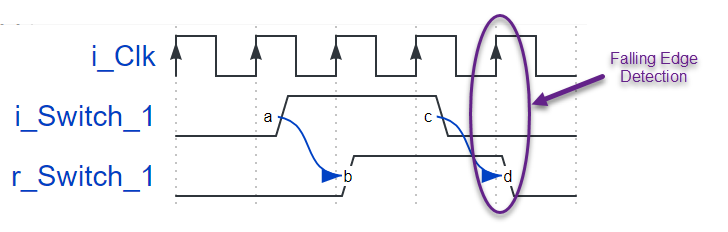

# Project 3 - The Flip-Flop (AKA Register)

- Related NandLand Youtube video: [Nandland Go Board Project 3 - The Flip-Flop (AKA Register)](https://www.youtube.com/watch?v=_7K-ty3Mffg)
- Original [Post at Nandland.com](https://www.nandland.com/goboard/registers-and-clocks-project.html).
- Preconfigured project is located in [projecs/project_3](../projects/project_3)
- Precompiled Bin is located in [projecs/project_3/bin](../projects/project_3/bin)

## Table of Contents

- [Introducing the D Flip-Flop](#building-your-fpga-design)
- [So What is A Flip-Flop?]()
- [Project Description](#project-description)
  - [Verilog](#verilog)
  - [VHDL](#vhdl)
  - [Building your design and Programming your FPGA](#building-your-design-and-programming-your-fpga)
  - [Tests](#tests)

## Introducing the D Flip-Flop

The [previous project introduced Look-Up Tables (LUTs)](./project_2.md).
This project will introduce a fundamental FPGA component: **The Flip-Flop**.
Flip-Flops are a critical component to making FPGAs work. 
A Flip-Flop can also be called a Register, the two are used interchangeably. 
Flip-Flops allow the FPGA to have knowledge of **state**. By state I mean that the FPGA is able to know what 
happened previously, and use that information to dictate what happens next. For example, if you want to look 
for a sequence of button pushes in order to illuminate an LED, you need to have information about state. 
Let's say you want to illuminate LED 1 if the user first presses and releases Switch 1, 
then presses and releases Switch 2. *This would not be possible using LUTs alone.* Or what about a situation 
where you want to increment a counter every time a button is pressed? The only way to increment a counter 
is to have knowledge of its previous value, and then add 1 to the previous value to create the new value. 
Again, this is not possible without Flip-Flops.

I also created a YouTube video for this project, should you prefer to follow along with that.

[](https://www.youtube.com/watch?v=_7K-ty3Mffg)

## So What is A Flip-Flop?

If you've taken a logic class before, you've probably been taught about the different types of Flip-Flops:
- D Flip-Flop
- JK Flip-Flop
- T Flip-Flop.

I don't really understand why professors like to talk about all the different types of Flip-Flops. 
In the real world, 99.9999% of Flip-Flops are the D Flip-Flop. I've been designing FPGAs for over 10 years 
and I've never once seen or used a different type of Flip-Flop other than the D Flip-Flop (DFF).

The D Flip Flop! (Source: [Wikipedia](https://en.wikipedia.org/wiki/Flip-flop_(electronics))):


Let's look at a picture of a D Flip-Flop from Wikipedia. The image above shows every single pin on a normal Flip-Flop. 
I'll go through them quickly now, then I'll tell you to ignore most of them and only focus on following pins: 
- The top of the device contains the pin `S`: this is the Set input. 
- On the bottom, there's the pin labelled `R`: this is the Reset input. 
- On the right side is an output pin labelled `Q`: this is the output.
- On the right side is an output pin labelled `Qbar`: this contains the opposite value of the output `Q`.

Now that I told you what those pins are for, let's completely forget about them! 

Let's instead look at the three most important pins on a Flip-Flop and focus on those:
- `D`: Data Input to Flip-Flop
- `Q`: Data Output of Flip-Flop (Registered)
- `>`: Clock Input to Flip-Flop


The first question you might be asking yourself is, *what is a clock?*

No, not this type of clock:


This type of clock!


Digital clocks are what makes almost all digital circuits operate. One way to think about the clock in a system 
is to think of set of gears. In order for any gear in the system to turn, there must be some master gear 
that drives all the others. That is effectively the purpose of the clock in digital logic. 
It provides a steady stream of low-to-high-to-low again transitions of a voltage that lets your FPGA chug along. 
Plus the analogy is fun because the gears look a bit like the square wave of a digital clock.

The clock on the Go Board oscillates at 25 MHz, which means 25 million cycles per second. 
A single clock cycle is from one rising edge to the next rising edge.

The clock is what allows a Flip-Flop to be used as a data storage element. Any data storage elements are known 
as **sequential logic** or **registered logic**. Sequential logic operates on the transitions of a clock. 99.9% 
of the time this will be the *rising edge* (when the clock goes from 0 to 1).

> with a clock:
> ***rising edge*** is a synonym of positive edge and named `posedge`
> ***falling edge*** is a synonym of negative edge and named `negedge`

**When a Flip-Flop sees a rising edge of the clock, it *registers* the data from the Input `D` to the Output `Q`.**
 
Flip-Flops are what make complex FPGAs possible! Let's look at a waveform of a few events.

D Flip-Flop Input to Output:


The above waveform shows three clock cycle events, represented by the red arrow on the rising edge of the clock:
- In between the first and second rising edge of the clock, the `D` input goes from low to high. 
- The output `Q` sees that `D` has gone from low to high at the rising edge of the second clock cycle. 
- The rising edge is when the Flip Flop looks at the input data. At this point, `Q` becomes the same value as input `D`. 
- On the third rising edge, `Q` again checks the value of `D` and **registers** it (this is why flip-flops are often 
referred to as registers). Since it has not changed, `Q` stays high. 

Let's look at another waveform, D Flip-Flop Sequence of Events:


The above image shows a waveform of two inputs and one output for a D Flip-Flop. 
The D Flip-Flop is sensitive to the rising edge of the clock, so when the rising edge comes along, 
the input D is passed along to the output Q. 
This only occurs on the edges:
- On the first clock cycle, `Q` sees that `D` has become 1, so it toggles from 0 to 1. 
- On the second clock edge, `Q` again checks the value of `D` and sees that it is low again, so it becomes low. 

If you want more examples showing Flip-Flop waveforms, check out the [YouTube video - What is a Flip-Flop? How are they used in FPGAs?](https://youtu.com/lrXjuotxqzE) I made:

[](https://www.youtube.com/watch?v=lrXjuotxqzE)

Now that you know about clocks and Flip-Flops, let's talk about our next project.

## Project Description

**This project should toggle the state of LED 1, only when Switch 1 is released.**

By toggle, I mean that if the LED is off, it should turn on. If the LED is on, it should turn off. 
It might not be obvious yet, but this project requires Flip-Flops to complete. Without Flip-Flops, 
when the switch is released, how should it continue to stay on? There needs to be some storage 
element that "remembers" that the LED is ON. That indicates that we will need at least one Flip-Flop.



Additionally, the project description states that the LED should toggle only when Switch 1 is released. 
In order to know when it is released, that requires an additional Flip-Flop. This Flip-Flop will be used to detect 
a transition on Switch `SW1`. In this case, we are looking for the falling-edge of Switch `SW1`. 
A good way to look for a falling edge in an FPGA is to register the signal that you want to look at. 
When the current value (*unregistered*) is equal to a zero, but the previous value (*registered*) is equal to a one, 
then we know that a falling edge has occurred.

This project will also require some logic between the two Flip-Flops. This will be implemented in the form of a LUT. 
This project starts to show how Flip-Flops and LUTs work together to accomplish your goals. 
You're welcome to try this on your own, should you need some hints, you can refer to the VHDL and Verilog below.

### Verilog

Let's look at the Verilog code for this design.

```verilog
module Clocked_Logic_Intro
  (input  i_Clk,
   input  i_Switch_1,
   output o_LED_1);

  // register where state will be saved  
  reg r_LED_1    = 1'b0;
  reg r_Switch_1 = 1'b0;
 
  // Purpose: Toggle LED output when i_Switch_1 is released.
  always @(posedge i_Clk)
  begin
    r_Switch_1 <= i_Switch_1;         // Creates a Register
 
    // This conditional expression looks for a falling edge on i_Switch_1.
    // Here, the current value (i_Switch_1) is low, but the previous value
    // (r_Switch_1) is high.  This means that we found a falling edge.
    if (i_Switch_1 == 1'b0 && r_Switch_1 == 1'b1)
    begin
      r_LED_1 <= ~r_LED_1;         // Toggle LED output
    end
  end
 
  assign o_LED_1 = r_LED_1;
endmodule
```
Preconfigured project is located in [projecs/project_3/verilog/Clocked_Logic_Intro](../projects/project_3/verilog/Clocked_Logic_Intro)

> `1'b0` notation means: size: **1**, type: **b**it, value: **0**
> Notation: <decimal number representing size in bits>'<base format: d: decimal,b: binary,o: ordinal,h: hexadecimal><value: 0,1,x for unknown logic value,z for high impedance/floating>


Notice in the code above we have created a few new signals defined as `reg`. 
These signals I named `r_LED_1` and `r_Switch_1`, because I know that they will be turned into Flip-Flops (*Registers*). 
All signals that I know will become registers I call `r_<signal_name>`. 
It helps to keep the code organized and it helps when searching for signal names in a large file. 
A signal `r_Data` is much easier to find than a signal called `data`.

The next fundamental part of the code introduces a new verilog keyword: `always`. 
An always block is a block of code that is triggered by signals in the **sensitivity list**. 
The sensitivity list is the list of signals in the parenthesis after the `@` sign. 
In this case, this always block will be triggered whenever the signal `i_Clk` changes from a 0 to a 1, indicated
by the Verilog keyword `posedge`. 
Like I said previously, a *rising edge* of a clock will be used for 99.99% of the logic within your FPGA.
Always blocks are very complicated and require their own tutorial. 
[Luckily I already wrote one](https://www.nandland.com/vhdl/tutorials/tutorial-process-part1.html). 
I definitely recommend [reading that article](https://www.nandland.com/vhdl/tutorials/tutorial-process-part1.html) 
to get familiar with always blocks, they're going to become very important.

The rest of the code is used to create the logic we require to detect a falling edge on `i_Switch_1`,
and then toggle the state of the LED `o_LED_1`.

### VHDL

```vhdl
library ieee;
use ieee.std_logic_1164.all;

entity And_Gate_Project is
  port (
    -- Push-Button Switches:
    i_Switch_1 : in std_logic;
    i_Switch_2 : in std_logic;

    -- LED Pin:
    o_LED_1 : out std_logic
    );
end entity And_Gate_Project;

architecture RTL of And_Gate_Project is
begin
  o_LED_1 <= i_Switch_1 and i_Switch_2;
end RTL;
```
Preconfigured project is located in [projecs/project_3/vhdl/Clocked_Logic_Intro](../projects/project_3/vhdl/Clocked_Logic_Intro)
