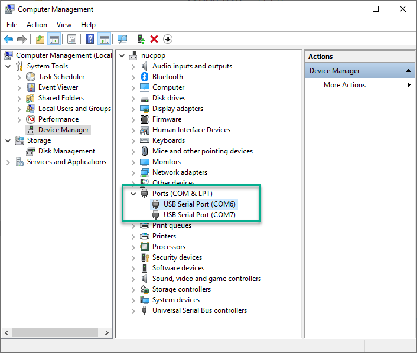
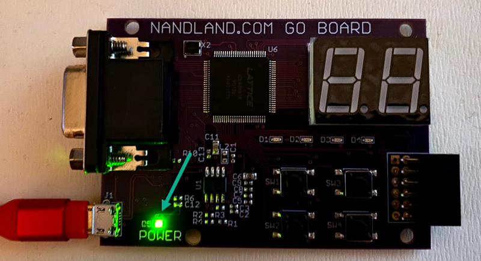
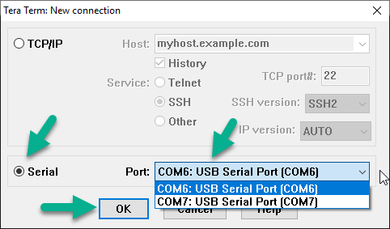
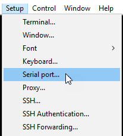
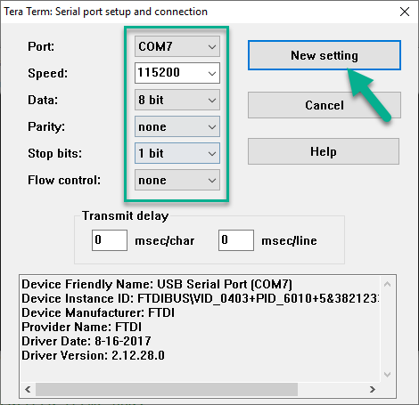
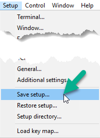
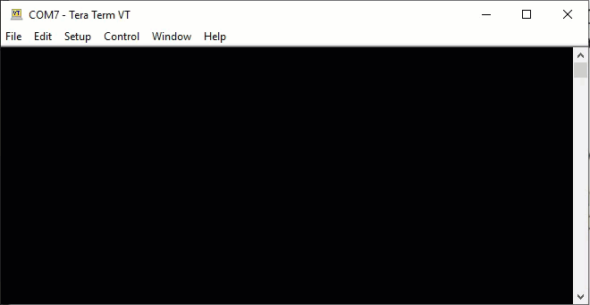
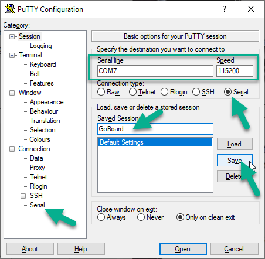
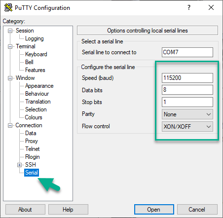
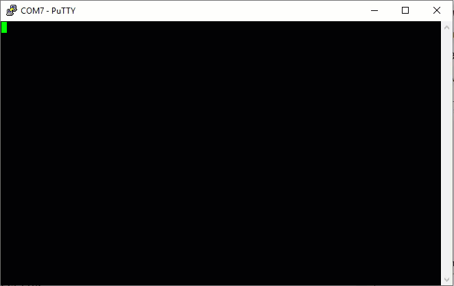

# Test your new GoBoar

Related NandLand Youtube video: [Nandland Go Board - Watch This When You Receive Your Board - at 2m0s](https://youtu.be/wWMIY9kjlJ0?t=121)

## Prerequisites

- a brand new GoBoard (eg: one that you never erased/reprogrammed)
- a USB cable <=> Micro USB cable with Data lines (not a charge only USB cable)

## COM Port

### Windows 10

In Windows 10, as of 2020/01/01, you can check if your GoBoard COM port are already detected 
without Virtual COM Port Drivers by going on your Device Manager and checking for COM Ports
before and after connecting your GoBoard micro USB Cable to your PC:

  

### Virtual Com Port Driver Install

If you don't see your COM Port, download and install Virtual Com Port Driver:  

- Download Drivers at [Virtual COM Port Drivers](https://www.ftdichip.com/Drivers/VCP.htm)
 
## Tests

### Switch and Leds

- Connect your usb cable between your GoBoard and your Computer
- Power Led should be active:

- pushing switch will:
  - upper left switch 1: led D1 will light up
  - bottom left switch 2: led D2 will light up
  - upper right switch 3: led D3 will light up
  - bottom right switch 4: led D4 will light up 
- 7 Segment LED Display 
  - by pushing upper left switch 1: Segments will cycle
  

### Test COM Connection

Install a COM port terminal:
- Nandland recommends [Tera Term VT](https://osdn.net/projects/ttssh2/releases/)
- alternatives: [Putty](https://www.putty.org/)

#### Tera Term VT config

Screenshots with Tera Term v4.105:

- Select `Serial`
- on `Port` select your COM Port, if one doesn't work try the next one available
- click `OK`

- Under `Setup` menu select `Serial Port...` 

- Select your COM `Port`
- Set:
  - `Speed` to `115200`
  - `Data` to `8 bit`
  - `Parity` to `none`
  - `Stop bits` to `1 bit`
  - `Flow control` to `none`
  - `Transmit delay` to `0` msec/char and `0` msec/line  
- click `New setting`

- On `Setup` menu, click on `Save setup...` and save `TERATERM.INI` over existing one.
This will save your setup for the next time to avoid reconfiguring it.

- Your board should already be connected to your computer
- try typing `12345abcdef`, your board will redirect your input to your terminal again: 

#### Putty config

- Open putty
- Set `Connection Type` to `Serial`
- Set `Serial Line` to your COM port, example here: `COM7`
- Set `Speed` to `115200`
- Set `Saved Session` to a meaningful name like `GoBoard`
- Click `Save` 
- Then click on `Serial Menu`

- By default you should have following configuration:
- if you modify this configuration don't forget to go back in `Session` menu and click `Save`

- Your board should already be connected to your computer
- try typing `12345abcdef`, your board will redirect your input to your terminal again: 

### Test VGA

Related Youtube Video[Nandland Go Board - Watch This When You Receive Your Board - at 4m50s](https://youtu.be/wWMIY9kjlJ0?t=290)

- Connect via COM port to your GoBoard 
- Connect a VGA cable to your GoBoard to your monitor
- Open your Terminal program (eg: Tera Term or Putty)
- Type `12345` in sequence, you should see on your monitor:

